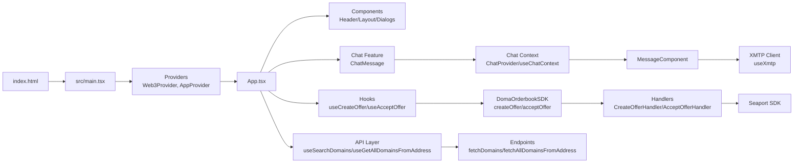

### 项目概述 / Project Overview

- 中文：一个基于 React + Vite 的去中心化应用，集成 DOMA Orderbook 进行域名交易（出价/接受出价），并通过 XMTP 提供链上消息聊天能力。
- English: A React + Vite dApp that integrates DOMA Orderbook for domain offers (create/accept) and uses XMTP for on-chain messaging/chat.

### 结构图 / Architecture Diagram

### 关键模块与关键函数 / Key Modules and Functions

| 模块 Module                   | 关键导出 Key Exports                                                                                                                                                                 | 说明 Note                                                                                                                                                                                                                    |
| --------------------------- | -------------------------------------------------------------------------------------------------------------------------------------------------------------------------------- | -------------------------------------------------------------------------------------------------------------------------------------------------------------------------------------------------------------------------- |
| **Application Bootstrap**   | `src/main.tsx` (`createRoot(...).render(<App />)`), `src/App.tsx` (`App`)                                                                                                        | 中文：应用入口与根组件装配（路由、主题、Web3 提供者）。 English: App entry and root composition (router, theme, Web3 providers).                                                                                                                |
| **Providers**               | `src/providers/web3-providers.tsx` (`Web3Provider`), `src/providers/app-provider.tsx` (`AppProvider`)                                                                            | 中文：初始化 wagmi/viem/connectkit 与全局应用状态。 English: Initializes wagmi/viem/connectkit and global app state.                                                                                                                 |
| **Context**                 | `src/context/app-context.tsx` (`AppContext`), `components/chat-message/context/chat-context.tsx` (`ChatProvider`, `useChatContext`)                                              | 中文：应用与聊天上下文状态与操作。 English: App and chat context state and actions.                                                                                                                                                     |
| **Hooks – Offers**          | `src/hooks/useCreateOffer.ts` (`createOffer`), `src/hooks/useAcceptOffer.ts` (`acceptOffer`)                                                                                     | 中文：封装出价与接受出价流程（桥接 wagmi Signer → DOMA SDK）。 English: Encapsulates offer creation and acceptance (wagmi Signer → DOMA SDK).                                                                                             |
| **Hook – XMTP**             | `src/hooks/useXmtp.ts` (`isLoadingXmtp`)                                                                                                                                         | 中文：连接/创建 XMTP Client，自动同步账号状态（内部 `connectXmtp`）。 English: Connects/creates XMTP Client and syncs account state (internal `connectXmtp`).                                                                               |
| **Hook – App**              | `src/hooks/useApp.ts` (`useApp`)                                                                                                                                                 | 中文：读取 `AppContext`。 English: Accesses `AppContext`.                                                                                                                                                                    |
| **DOMA SDK Facade**         | `src/classes/doma-orderbook.ts` (`DomaOrderbookSDK`, `createDomaOrderbookClient`, `getDomaOrderbookClient`)                                                                      | 中文：封装 DOMA Orderbook 核心能力：`createOffer` / `acceptOffer` / `getOrderbookFee` / `getSupportedCurrencies`。 English: Facade for DOMA Orderbook: `createOffer`, `acceptOffer`, `getOrderbookFee`, `getSupportedCurrencies`. |
| **Seaport Operation Base**  | `src/classes/seaport-operation-handler.ts` (`SeaportOperationHandler`)                                                                                                           | 中文：统一 Seaport 操作基类：`executeBlockchainOperation`、`getWalletAddress`。 English: Base class for Seaport ops: `executeBlockchainOperation`, `getWalletAddress`.                                                             |
| **Offer Handlers**          | `src/classes/doma-create-offer.ts` (`CreateOfferHandler#execute`), `src/classes/doma-accept-offer.ts` (`AcceptOfferHandler#execute`)                                             | 中文：具体出价/接受出价流水线（审批、签名、交易、回调）。 English: Concrete pipelines for create/accept offer (approvals, signatures, tx, callbacks).                                                                                              |
| **Core Helpers**            | `src/classes/core.ts` (`executeAllActions`, `buildOfferOrderInput`)                                                                                                              | 中文：动作流水线执行与订单构造（Seaport）。 English: Action pipeline executor and order input builder (Seaport).                                                                                                                         |
| **API Layer**               | `src/api/query.ts` (`useSearchDomains`, `useGetAllDomainsFromAddress`), `src/api/endpoints.ts` (`fetchDomains`, `fetchAllDomainsFromAddress`), `src/api/client.ts` (`apiClient`) | 中文：基于 Axios + GraphQL 的域名搜索与地址域名查询。 English: Axios + GraphQL domain search and address-owned names queries.                                                                                                            |
| **Chat Feature**            | `src/components/chat-message/index.tsx` (`ChatMessage`), `components/chat-message/components/message/index.tsx` (`MessageComponent`)                                             | 中文：聊天列表与会话视图（XMTP 消息流、日期分组、发送）。 English: Chat list and conversation view (XMTP stream, date grouping, sending).                                                                                                        |
| **Components (General/UI)** | `src/components/*`, `src/components/ui/*`                                                                                                                                        | 中文：通用界面组件与 UI 原子组件。 English: General components and UI primitives.                                                                                                                                                     |

---

建议的 Git 提交信息 / Suggested Git Commit Message

- feat(domainline): add REVERSE.md with architecture, key modules and functions

  - 中文：新增 REVERSE.md，包含项目概述、架构图（Mermaid）以及关键模块/函数表格，便于快速理解与维护。
  - English: Add REVERSE.md with project overview, Mermaid architecture diagram, and key modules/functions table for quick understanding and maintenance.
